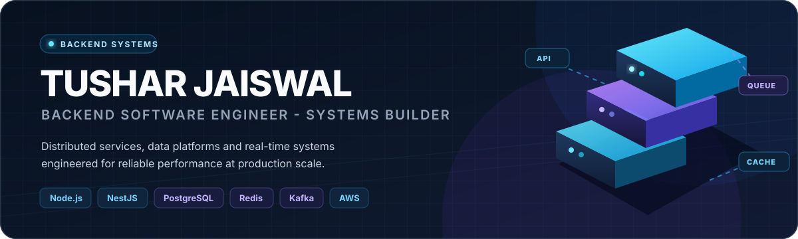
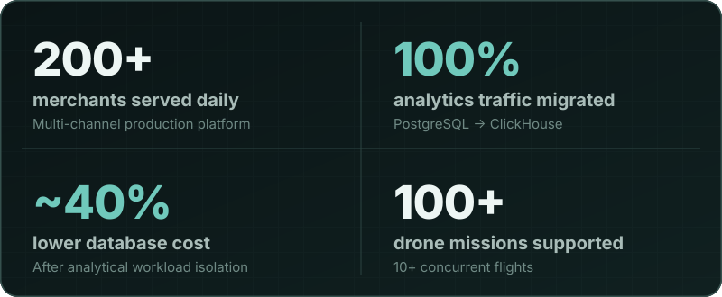
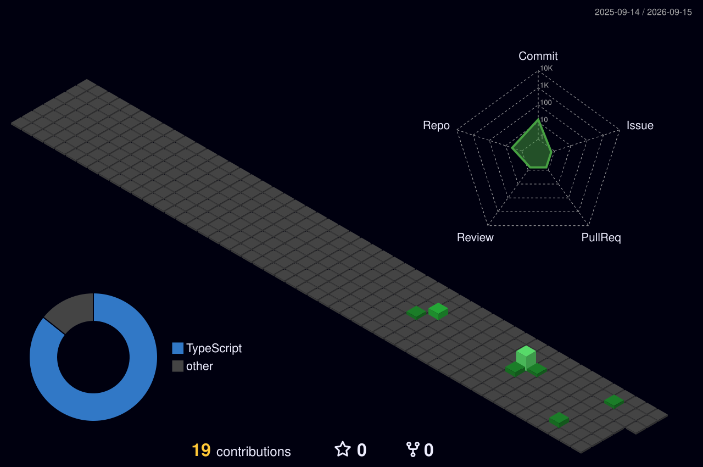

<div align="center">
  <picture>
    <source media="(max-width: 800px)" srcset="./assets/hero-mobile.svg" />
    
  </picture>

  <p>
    <a href="https://www.linkedin.com/in/tushar-jaiswal-a231871b6"><strong>LinkedIn</strong></a>
    &nbsp;·&nbsp;
    <a href="mailto:tusharjaiswal2k@gmail.com"><strong>Email</strong></a>
    &nbsp;·&nbsp;
    Faridabad, India
  </p>
</div>

# Backend systems, designed for the long run.

I'm Tushar Jaiswal, a backend software engineer with about four years of experience building distributed services, data platforms, and real-time operational systems.

I work at the point where product growth becomes systems work: defining service boundaries, moving data safely, designing for failure, and giving teams the tooling to operate production with confidence.

<div align="center">
  <picture>
    <source media="(max-width: 800px)" srcset="./assets/impact-mobile.svg" />
    
  </picture>
</div>

## Selected systems

### Analytics platform · PostgreSQL → ClickHouse

**Constraint.** Analytical workloads were competing with transactional traffic and increasing database cost.

**Engineering.** Led the migration path from PostgreSQL to ClickHouse, including data movement, query cutover, validation, and operational safeguards.

**Outcome.** Offloaded **100% of analytics query traffic** and reduced database cost by **~40%** while preserving confidence in reporting.

---

### KwikEngage · support and billing operations

**Constraint.** Support teams needed faster diagnosis across chat, billing, and merchant workflows without adding more manual process.

**Engineering.** Built Chat ID-based retrieval, billing visibility, reconciliation, alerting, and AI-assisted internal tools around the production workflow.

**Outcome.** Contributed to **~40% faster issue resolution**, **~30% less manual support effort**, and **~90% fewer billing discrepancies**.

---

### DCIS v2 · real-time drone operations

**Constraint.** Concurrent flights require predictable mission planning, live telemetry, and safe responses to changing conditions.

**Engineering.** Developed mission-planning, automated flight-booking, collision-avoidance, and monitoring services for a real-time control system.

**Outcome.** Supported **100+ missions** and **10+ concurrent flights**, with **~40% faster planning** and **~35% faster incident response**.

## How I approach engineering

```text
Make the critical path explicit   → model ownership, load, and failure modes
Move data with an exit strategy   → validate, observe, cut over, and roll back
Treat operability as a feature    → logs, metrics, alerts, and useful runbooks
Automate repeated judgment        → build tools that make the safe path easier
Optimize for the next operator    → leave systems clearer than I found them
```

## Technical focus

**Core services**<br>
`TypeScript` · `JavaScript` · `Node.js` · `NestJS` · `Python`

**Data and messaging**<br>
`PostgreSQL` · `ClickHouse` · `MongoDB` · `MySQL` · `TimescaleDB` · `Redis` · `Kafka`

**Cloud and delivery**<br>
`AWS` · `Docker` · `GitHub Actions` · `CI/CD` · `CloudFront` · `Akamai`

**Systems work**<br>
Distributed systems · microservices · real-time telemetry · analytics migrations · reliability · MCP-based automation

## Experience

### Primathon (GoKwik) · Software Developer

Backend services for multi-channel engagement, billing reliability, analytics, CDN delivery, and AI-assisted operations—serving **200+ merchants daily**.

### TSAW Drones · Software Developer

Mission planning, flight-data processing, collision avoidance, telemetry, and precision-agriculture services for concurrent drone operations.

### Tech Compiler · Software Developer

Frontend performance, state management, caching, and build optimization, with a focus on faster and more predictable delivery.

## Beyond the commit count

I care about code that changes an operating metric: lower cost, faster diagnosis, safer migrations, fewer manual steps, or a system that remains understandable as it grows.

<details>
  <summary><strong>View public contribution activity</strong></summary>
  <br />
  <div align="center">
    
  </div>
  <sub>Generated daily from this repository owner's public GitHub contribution data.</sub>
</details>

## Let's build something dependable

I'm open to conversations about backend platforms, distributed systems, data infrastructure, real-time products, practical AI tooling, and software engineering opportunities.

<a href="mailto:tusharjaiswal2k@gmail.com"><strong>Send me an email</strong></a>
&nbsp;·&nbsp;
<a href="https://www.linkedin.com/in/tushar-jaiswal-a231871b6"><strong>Connect on LinkedIn</strong></a>
