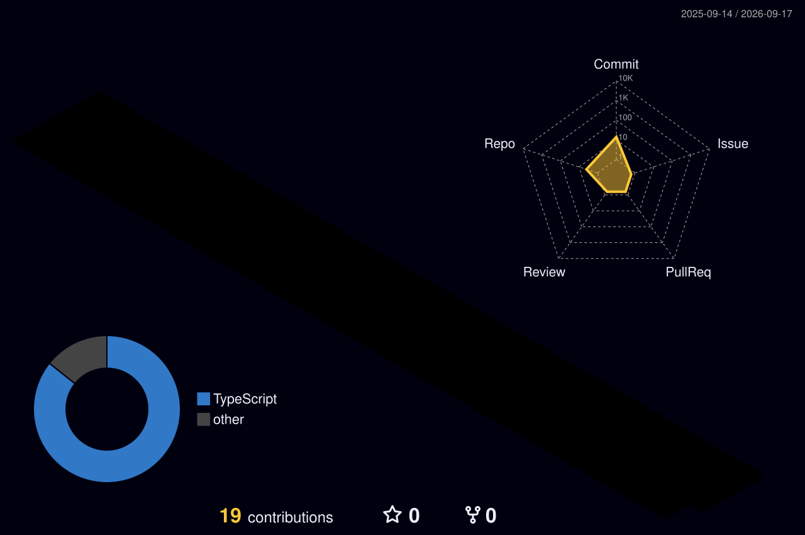

  

  
  
  

## 01 - About

I'm a backend software engineer with **about four years of experience** building scalable distributed systems across product teams and startups. I work on high-throughput services, data platforms, real-time workflows, and the operational tooling that keeps them reliable.

- Helped scale a multi-channel engagement platform serving **200+ merchants daily**
- Led a PostgreSQL-to-ClickHouse analytics migration, offloading **100% of query traffic** and cutting database cost by **about 40%**
- Improved billing accuracy to **about 95%** by redesigning reconciliation, reporting, and alerting workflows
- Built drone mission, telemetry, and path-planning services supporting **100+ missions** and **10+ concurrent flights**
- Used automation and MCP-based tools to reduce manual customer-success effort by **about 20%**

## 02 - Stack

  

| Area | Technologies |
| --- | --- |
| **Backend** | Node.js, NestJS, JavaScript, TypeScript, Python |
| **Data** | PostgreSQL, ClickHouse, MongoDB, MySQL, TimescaleDB, Redis |
| **Cloud & delivery** | AWS, EC2, S3, SES, CloudFront, Akamai, Docker |
| **Systems** | Apache Kafka, microservices, distributed systems, real-time telemetry, MCP |
| **Delivery** | GitHub Actions, Bitbucket, CI/CD |

## 03 - Experience

| Role | Organization | Focus |
| --- | --- | --- |
| **Software Developer** | Primathon (GoKwik) | Multi-channel engagement, billing reliability, analytics migration, CDN delivery, and AI-assisted operations |
| **Software Developer** | TSAW Drones | Mission planning, flight-data processing, collision avoidance, telemetry, and precision-agriculture services |
| **Software Developer** | Tech Compiler | Frontend performance, state management, caching, and build optimization |

## 04 - Selected work

| Project | What I worked on | Result |
| --- | --- | --- |
| **KwikEngage** | Chat intelligence, Chat ID-based retrieval, billing visibility, and internal support tooling | About **40% faster issue resolution**, **30% less manual support effort**, and **90% fewer billing discrepancies** |
| **DCIS v2** | Collision avoidance, mission planning, automated flight booking, and real-time monitoring | About **40% faster mission planning**, **30% lower collision risk**, and **35% faster incident response** |
| **Analytics platform** | PostgreSQL-to-ClickHouse migration and query-traffic offloading | Better analytical performance with database costs reduced by **about 40%** |

## 05 - Engineering focus

<pre>
scalability     -> distributed services, Kafka, high-throughput workflows
data platforms  -> PostgreSQL, ClickHouse, analytics and migration strategy
reliability     -> reconciliation, alerting, observability and SLA adherence
performance     -> caching, CDN/edge delivery, query and build optimization
automation      -> practical AI and MCP tools for operational workflows
</pre>

## 06 - 3D contribution activity

  

This graph is generated daily in this repository using the repository owner's public contribution data.

## 07 - Connect

I'm open to conversations about backend platforms, distributed systems, data infrastructure, real-time products, practical AI tooling, and software engineering opportunities.

  <a href="https://www.linkedin.com/in/tushar-jaiswal-a231871b6"><strong>LinkedIn</strong></a>
  &nbsp;-&nbsp;
  <a href="mailto:tusharjaiswal2k@gmail.com"><strong>Email</strong></a>

